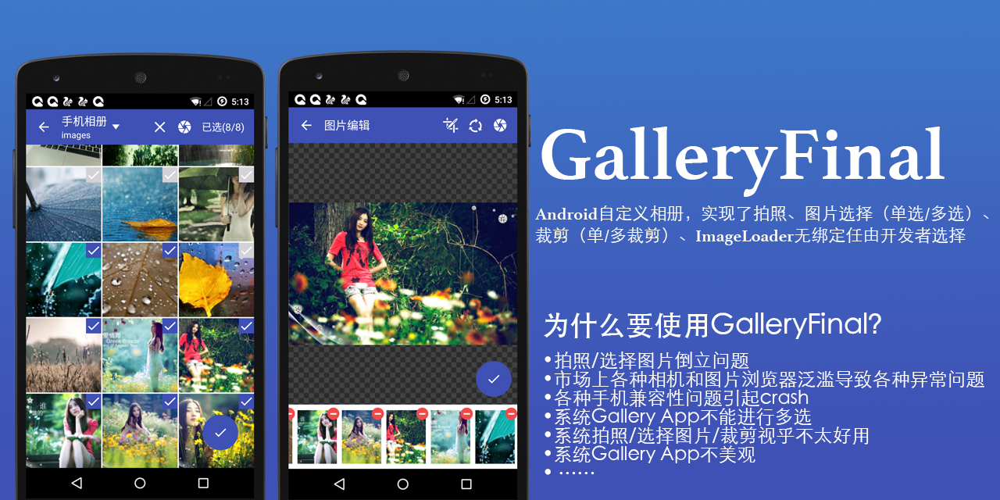
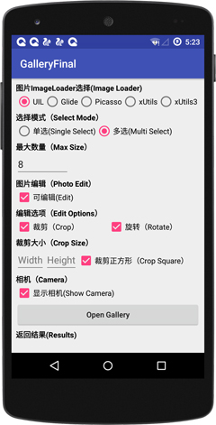
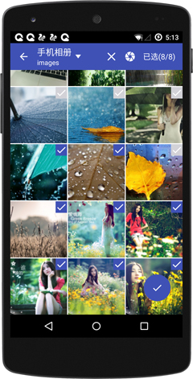
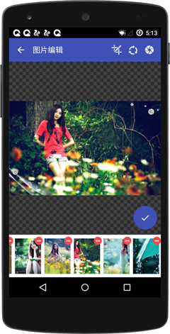

# GalleryFinal简介
Android自定义相册，实现了拍照、图片选择（单选/多选）、 裁剪（单/多裁剪）、旋转、ImageLoader无绑定任由开发者选择、功能可配置、主题样式可配置。GalleryFinal为你定制相册。

## 为什么要使用GalleryFinal？
* 拍照/选择图片倒立问题
* 市场上各种相机和图片浏览器泛滥导致各种异常问题
* 各种手机兼容性问题引起crash
* 系统Gallery App不能进行多选
* 系统拍照/选择图片/裁剪视乎不太好用
* 系统Gallery App不美观
* ……

** [简书文章](http://www.jianshu.com/p/48ddd6756b7a) **

###**注：1)、现支持所有主流的ImageLoader，包括Glide/Fresco/Picasso/UIL等，如果你觉得还不满足，欢迎在issues上提问。2)、本项目是基于SDK 23（6.0）系统编译的请开发者将targetSdkVersion改成23**

## 截图展示
Demo apk二维码地址：



       


# GalleryFinal使用方法

## 下载GalleryFinal
通过Gradle抓取:

```gradle
compile 'cn.finalteam:galleryfinal:1.4.8.7'
compile 'com.android.support:support-v4:23.1.1'
```

# Next Version
* 添加多选强制裁剪
* 图片分页查看
* 拍照自动纠正图片(自动旋转)
* 添加配置-配置图片压缩到指定大小后返回调用者
* 精简配置
* ……

# 1.4.8.4更新内容
* 解决fresco gif图片不显示问题

## 具体使用
1、通过gradle把GalleryFinal添加到你的项目里

2、在你的Application中添加配置GallerFinal

```java
//设置主题
//ThemeConfig.CYAN
ThemeConfig theme = new ThemeConfig.Builder()
        ...
        .build();
//配置功能
FunctionConfig functionConfig = new FunctionConfig.Builder()
        .setEnableCamera(true)
        .setEnableEdit(true)
        .setEnableCrop(true)
        .setEnableRotate(true)
        .setCropSquare(true)
        .setEnablePreview(true)
        ...
        .build();

//配置imageloader
ImageLoader imageloader = new UILImageLoader();       
CoreConfig coreConfig = new CoreConfig.Builder(context, imageloader, theme)
        .setDebug(BuildConfig.DEBUG)
        .setFunctionConfig(functionConfig)
        ...
        .build();
GalleryFinal.init(coreConfig);
```

3、选择图片加载器

* **UIL实现**
[使用UniversalImageLoader点这里](https://github.com/pengjianbo/GalleryFinal/blob/master/app/src/main/java/cn/finalteam/galleryfinal/sample/loader/UILImageLoader.java)

* **Glide实现**
[使用Glide点这里](https://github.com/pengjianbo/GalleryFinal/blob/master/app/src/main/java/cn/finalteam/galleryfinal/sample/loader/GlideImageLoader.java)

* **Picasso实现**
[使用picasso点这里](https://github.com/pengjianbo/GalleryFinal/blob/master/app/src/main/java/cn/finalteam/galleryfinal/sample/loader/PicassoImageLoader.java)

* **fresco实现**
[使用fresco点这里](https://github.com/pengjianbo/GalleryFinal/blob/master/app/src/main/java/cn/finalteam/galleryfinal/sample/loader/FrescoImageLoader.java)

* **xUtils3实现**
[使用xUtils点这里](https://github.com/pengjianbo/GalleryFinal/blob/master/app/src/main/java/cn/finalteam/galleryfinal/sample/loader/XUtilsImageLoader.java)

* **xUitls2实现**
[使用xUtils2点这里](https://github.com/pengjianbo/GalleryFinal/blob/master/app/src/main/java/cn/finalteam/galleryfinal/sample/loader/XUtils2ImageLoader.java)


* **自定义**

自定义步骤：

1)、实现ImageLoader接口

2)、在displayImage方法中实现图片加载，**这个需要注意的是一定要禁止缓存到本地和禁止缓存到内存**

3)、设置请求图片目标大小。displayImage方法中已经给出了width和height

4)、设置默认图和请求图片清晰度，建议把图片请求清晰度调整为Bitmap.Config.RGB_565避免出现OOM情况

* ……

4、启动GalleryFinal

在GalleryFinal 1.3.0版本中相册、拍照、裁剪和图片编辑功能可独立使用

**REQUEST_CODE_GALLERY 为请求码**
**functionConfig 为功能配置**
**mOnHanlderResultCallback 为请求回调**

* 单选打开相册

```java
GalleryFinal.openGallerySingle(REQUEST_CODE_GALLERY, mOnHanlderResultCallback);
//带配置
GalleryFinal.openGallerySingle(REQUEST_CODE_GALLERY, functionConfig, mOnHanlderResultCallback);

```

* 多选打开相册
```java
GalleryFinal.openGalleryMuti(REQUEST_CODE_GALLERY, mOnHanlderResultCallback);
//带配置
FunctionConfig config = new FunctionConfig.Builder(MainActivity.this)
    .setMutiSelectMaxSize(8)
    .build();
GalleryFinal.openGalleryMuti(REQUEST_CODE_GALLERY, functionConfig, mOnHanlderResultCallback);

```

* 使用拍照

```java
GalleryFinal.openCamera(REQUEST_CODE_CAMERA, mOnHanlderResultCallback);
//带配置
GalleryFinal.openCamera(REQUEST_CODE_CAMERA, functionConfig, mOnHanlderResultCallback);
```

* 使用裁剪

```java
GalleryFinal.openCrop(REQUEST_CODE_CROP, mOnHanlderResultCallback);
//带配置
GalleryFinal.openCrop(REQUEST_CODE_CROP, functionConfig, mOnHanlderResultCallback);
```

* 使用图片编辑

```java
GalleryFinal.openEdit(REQUEST_CODE_EDIT, mOnHanlderResultCallback);
//带配置
GalleryFinal.openEdit(REQUEST_CODE_EDIT, functionConfig, mOnHanlderResultCallback);
```

* **FunctionConfig Builder类说明**

```java
setMutiSelect(boolean)//配置是否多选
setMutiSelectMaxSize(int maxSize)//配置多选数量
setEnableEdit(boolean)//开启编辑功能
setEnableCrop(boolean)//开启裁剪功能
setEnableRotate(boolean)//开启旋转功能
setEnableCamera(boolean)//开启相机功能
setCropWidth(int width)//裁剪宽度
setCropHeight(int height)//裁剪高度
setCropSquare(boolean)//裁剪正方形
setSelected(List)//添加已选列表,只是在列表中默认呗选中不会过滤图片
setFilter(List list)//添加图片过滤，也就是不在GalleryFinal中显示
takePhotoFolter(File file)//配置拍照保存目录，不做配置的话默认是/sdcard/DCIM/GalleryFinal/
setRotateReplaceSource(boolean)//配置选择图片时是否替换原始图片，默认不替换
setCropReplaceSource(boolean)//配置裁剪图片时是否替换原始图片，默认不替换
setForceCrop(boolean)//启动强制裁剪功能,一进入编辑页面就开启图片裁剪，不需要用户手动点击裁剪，此功能只针对单选操作
setForceCropEdit(boolean)//在开启强制裁剪功能时是否可以对图片进行编辑（也就是是否显示旋转图标和拍照图标）
setEnablePreview(boolean)//是否开启预览功能
```


* **主题的配置**

1)、GalleryFinal默认主题为DEFAULT（深蓝色）,还自带主题：DARK（黑色主题）、CYAN（蓝绿主题）、ORANGE（橙色主题）、GREEN（绿色主题）和TEAL（青绿色主题），当然也支持自定义主题（Custom Theme）,在自定义主题中用户可以配置字体颜色、图标颜色、更换图标、和背景色

* 设置主题

1)、使用自定义主题

```java
 GalleryTheme theme = new GalleryTheme.Builder()
        .setTitleBarBgColor(Color.rgb(0xFF, 0x57, 0x22))
        .setTitleBarTextColor(Color.BLACK)
        .setTitleBarIconColor(Color.BLACK)
        .setFabNornalColor(Color.RED)
        .setFabPressedColor(Color.BLUE)
        .setCheckNornalColor(Color.WHITE)
        .setCheckSelectedColor(Color.BLACK)
        .setIconBack(R.mipmap.ic_action_previous_item)
        .setIconRotate(R.mipmap.ic_action_repeat)
        .setIconCrop(R.mipmap.ic_action_crop)
        .setIconCamera(R.mipmap.ic_action_camera)
        //...其他配置
        .build();
GalleryFinal.init(theme);
```
2)、**ThemeConfig类说明**
```java
setTitleBarTextColor//标题栏文本字体颜色
setTitleBarBgColor//标题栏背景颜色
setTitleBarIconColor//标题栏icon颜色，如果设置了标题栏icon，设置setTitleBarIconColor将无效
setCheckNornalColor//选择框未选颜色
setCheckSelectedColor//选择框选中颜色
setCropControlColor//设置裁剪控制点和裁剪框颜色
setFabNornalColor//设置Floating按钮Nornal状态颜色
setFabPressedColor//设置Floating按钮Pressed状态颜色

setIconBack//设置返回按钮icon
setIconCamera//设置相机icon
setIconCrop//设置裁剪icon
setIconRotate//设置旋转icon
setIconClear//设置清楚选择按钮icon（标题栏清除选择按钮）
setIconFolderArrow//设置标题栏文件夹下拉arrow图标
setIconDelete//设置多选编辑页删除按钮icon
setIconCheck//设置checkbox和文件夹已选icon
setIconFab//设置Floating按钮icon
setEditPhotoBgTexture//设置图片编辑页面图片margin外背景
setIconPreview设置预览按钮icon
setPreviewBg设置预览页背景
```

* **CoreConfig配置类**
```java
Builder(Context context, ImageLoader imageLoader, ThemeConfig themeConfig) //构建CoreConfig所需ImageLoader和ThemeConfig
setDebug //debug开关
setEditPhotoCacheFolder(File file)//配置编辑（裁剪和旋转）功能产生的cache文件保存目录，不做配置的话默认保存在/sdcard/GalleryFinal/edittemp/
setTakePhotoFolder设置拍照保存目录，默认是/sdcard/DICM/GalleryFinal/
setFunctionConfig //配置全局GalleryFinal功能
setNoAnimcation//关闭动画
setPauseOnScrollListener//设置imageloader滑动加载图片优化OnScrollListener,根据选择的ImageLoader来选择PauseOnScrollListener
```

5、如果你还想更深度的定制页面效果可以把资源文件名字定义成Gallery资源名已达到覆盖效果。如有不理解可以联系我。


# 权限
```xml
<uses-permission android:name="android.permission.MOUNT_UNMOUNT_FILESYSTEMS" />
<uses-permission android:name="android.permission.WRITE_EXTERNAL_STORAGE" />
<uses-permission android:name="android.permission.READ_EXTERNAL_STORAGE" />
```

# 混淆配置   
```properties
-keep class cn.finalteam.galleryfinal.widget.*{*;}
-keep class cn.finalteam.galleryfinal.widget.crop.*{*;}
-keep class cn.finalteam.galleryfinal.widget.zoonview.*{*;}
```

## [更新日志](https://github.com/pengjianbo/GalleryFinal/blob/master/CHANGELOG.md)


# 感谢（Thanks）
* 图片裁剪[android-crop](https://github.com/jdamcd/android-crop)
* 图片缩放[PhotoView](https://github.com/chrisbanes/PhotoView)

# 关于作者
* **QQ:**172340021   
* **QQ群:**218801658  
* **Email:**<pengjianbo@finalteam.cn>


License
-------

    Licensed under the Apache License, Version 2.0 (the "License");
    you may not use this file except in compliance with the License.
    You may obtain a copy of the License at

       http://www.apache.org/licenses/LICENSE-2.0

    Unless required by applicable law or agreed to in writing, software
    distributed under the License is distributed on an "AS IS" BASIS,
    WITHOUT WARRANTIES OR CONDITIONS OF ANY KIND, either express or implied.
    See the License for the specific language governing permissions and
    limitations under the License.
    
    


  [1]: https://github.com/pengjianbo/GalleryFinal/blob/master/app/src/main/java/cn/finalteam/galleryfinal/sample/loader/UILImageLoader.java